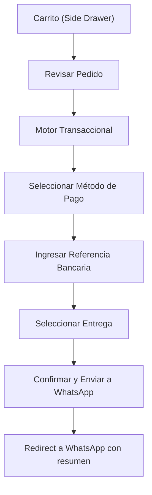

# Suministros L&D — Arquitectura E-Commerce Dinámico Híbrido (B2B/B2C)

> **Documento de Arquitectura, Diseño y Planificación Estratégica — Fase I**
> Stack: Next.js (App Router) + TailwindCSS + Supabase
> Modelo: WhatsApp Checkout Híbrido B2B/B2C

---

## User Review Required

> [!IMPORTANT]
> Este documento requiere aprobación antes de iniciar implementación. Revisa cada sección y confirma o ajusta las decisiones de diseño.

> [!WARNING]
> La paleta de colores, tipografía y estructura de carpetas definidas aquí serán la base inamovible del proyecto. Cambios posteriores implicarán refactorización significativa.

## Open Questions

1. **Logo actual**: Existe un logotipo vectorial (SVG) de "Suministros L&D" listo para integrar, o se debe diseñar desde cero?
2. **Catálogo inicial**: Cuántos productos aproximados entran en Fase I? (Esto afecta la estrategia de paginación y filtrado).
3. **API BCV**: Se usará un scraper propio, un servicio como `pfrancia/bcv-api`, o una fuente de terceros para la tasa BCV en tiempo real?
4. **Cashea**: Existe documentación de integración/API de Cashea disponible, o se maneja solo como banner informativo con enlace externo?
5. **Imágenes de producto**: Se dispone de fotografía profesional de los productos, o se usarán imágenes de proveedor/stock?
6. **Número de WhatsApp corporativo**: Es un solo número o hay múltiples líneas para despacho/ventas?

---

## 1. ARQUITECTURA DE INFORMACIÓN DEL HOME

> Metodologías aplicadas: [brainstorming](file:///home/alejo/Documentos/Proyectos/SuministrosL&D-Ecommerce/Skills/antigravity-awesome-skills-main/plugins/antigravity-awesome-skills/skills/brainstorming/SKILL.md), [idea-refine](file:///home/alejo/Documentos/Proyectos/SuministrosL&D-Ecommerce/Skills/agent-skills-main/skills/idea-refine/SKILL.md), [page-cro](file:///home/alejo/Documentos/Proyectos/SuministrosL&D-Ecommerce/Skills/antigravity-awesome-skills-main/plugins/antigravity-awesome-skills/skills/page-cro/SKILL.md)

### 1.1 Estructura Jerárquica de Secciones

La landing page sigue un **flujo de persuasión descendente** diseñado para dos personas simultáneamente: el comprador casero rápido y el contratista/electricista B2B.

```
┌─────────────────────────────────────────────────────────┐
│  S0. NAVBAR STICKY                                      │
│  Logo | Búsqueda SKU/Nombre | Carrito | WhatsApp FAB    │
├─────────────────────────────────────────────────────────┤
│  S1. HERO SECTION — Split Screen Asimétrico             │
│  "Tu aliado en iluminación y materiales eléctricos      │
│   de todo los Valles del Tuy"                           │
│  [CTA: Ver Catálogo]  +  Tasa BCV en vivo (badge)      │
├─────────────────────────────────────────────────────────┤
│  S2. BARRA DE ACELERADORES FINANCIEROS                  │
│  [ Tasa BCV Oficial Hoy: Bs. XX,XX ]                   │
│  [ Cashea: Compra a cuotas sin tarjeta ]                │
├─────────────────────────────────────────────────────────┤
│  S3. PRODUCTOS DE ALTA ROTACIÓN — Grid de 3 Categorías  │
│  Luminaria LED | Brekeras | Cableado Pesado             │
│  (Botones gráficos inmediatos con ícono SVG + label)    │
├─────────────────────────────────────────────────────────┤
│  S4. OFERTAS DE VOLUMEN / B2B SPOTLIGHT                 │
│  Tarjetas de producto destacadas con Volume Pricing     │
│  "Llévate la caja completa y ahorra X%"                 │
├─────────────────────────────────────────────────────────┤
│  S5. PROPUESTA DE VALOR / POR QUÉ NOSOTROS             │
│  3 pilares: Calidad | Variedad | Mejores Precios        │
│  (Iconos SVG, sin emojis — máximo 3 items)              │
├─────────────────────────────────────────────────────────┤
│  S6. COBERTURA Y LOGÍSTICA                              │
│  Mapa visual simplificado de Valles del Tuy             │
│  Delivery Gratis Charallave | Flete resto del Tuy       │
├─────────────────────────────────────────────────────────┤
│  S7. TRUST BAR — Señales de Confianza                   │
│  Métodos de Pago: Zelle | Binance | Pago Móvil          │
│  + Años de experiencia + Ubicación física               │
├─────────────────────────────────────────────────────────┤
│  S8. FOOTER                                             │
│  Datos fiscales | Dirección Charallave | WhatsApp        │
│  Horarios | Redes Sociales | Enlace a Cashea            │
└─────────────────────────────────────────────────────────┘
```

### 1.2 Lógica de Cada Sección

#### S0. Navbar Sticky

| Elemento | Función | Prioridad |
|----------|---------|-----------|
| Logo SVG | Identidad de marca, clic regresa al home | Alta |
| Barra de búsqueda | Búsqueda por nombre de pieza O código SKU interno | Alta |
| Indicador de carrito | Muestra cantidad de items, clic abre side-drawer | Alta |
| Botón WhatsApp (FAB móvil) | Contacto directo, visible siempre en mobile | Alta |
| Tasa BCV micro-badge | Muestra "USD/Bs: XX,XX" actualizado | Media |

- **Búsqueda Estratégica Mixta**: El input acepta tanto texto libre ("panel LED 60x60") como código alfanumérico ("SKU-0412"). Autocompletado con debounce de 300ms contra Supabase full-text search.
- En mobile, la barra de búsqueda colapsa a un ícono de lupa que expande un overlay full-width.

#### S1. Hero Section — Split Screen

- **Layout**: Asimétrico 55/45 (texto izquierda, imagen/visual derecha). Se prohíbe el hero centrado genérico (regla design-taste-frontend, DESIGN_VARIANCE: 8).
- **Headline (H1)**: "Tu aliado en iluminación y materiales eléctricos de todo los Valles del Tuy".
- **Subheadline**: "Precios al detal y por volumen. Cotiza, paga y recibe — todo desde tu celular."
- **CTA primario**: `Ver Catálogo Completo` — botón sólido con color accent.
- **CTA secundario**: `Cotiza tu Obra por WhatsApp` — botón outline, menor peso visual.
- **Badge BCV**: Chip flotante con la tasa del día, refuerza la transparencia de precios.
- **Visual derecho**: Fotografía de alta calidad de productos estrella (paneles LED iluminados) o composición de producto con tratamiento de iluminación dramática.

#### S2. Barra de Aceleradores Financieros

Tira horizontal (full-width) con fondo sutil diferenciado (1 shade más oscuro que el body) que contiene dos módulos:

| Módulo | Contenido | Objetivo |
|--------|-----------|----------|
| **BCV en vivo** | "Tasa Oficial BCV Hoy: 1 USD = Bs. XX,XX" + timestamp de actualización | Transparencia, confianza |
| **Cashea** | "Compra a cuotas sin tarjeta de crédito" + logo Cashea + CTA `Conoce más` | Reducir barrera de pago B2C |

- No es un banner rotativo/carrusel. Son **dos módulos estáticos lado a lado** en desktop, apilados en mobile.
- Diseño sobrio: sin animaciones disruptivas, sin colores saturados.

#### S3. Productos de Alta Rotación

Grid de **3 botones gráficos** que funcionan como accesos directos a las categorías estrella:

| Categoría | Ícono SVG | Acción |
|-----------|-----------|--------|
| Luminaria LED | Ícono de panel/bombillo LED | Navega a `/categorias/luminaria-led` |
| Sistemas de Control (Brekeras) | Ícono de breaker/panel eléctrico | Navega a `/categorias/brekeras` |
| Cableado Pesado | Ícono de rollo de cable | Navega a `/categorias/cableado` |

- Cada botón es una tarjeta con ícono SVG limpio (stroke weight 1.5, monocromático) + label de texto + micro-texto con cantidad de productos disponibles.
- Hover: elevación sutil con `translate-y(-2px)` + shadow tinted al color accent.
- Mobile: grid 1x3 horizontal con scroll si es necesario, o apilado vertical.

#### S4. Ofertas de Volumen / B2B Spotlight

- Muestra 3-4 tarjetas de producto con **Volume Pricing** activo (ver sección 3 para anatomía detallada).
- Título de sección: "Precios por volumen para tu obra".
- Subtítulo: "Llevando la caja completa, tu margen mejora."
- CTA al final: `Ver todos los productos con descuento por volumen`.

#### S5. Propuesta de Valor

3 pilares alineados horizontalmente (desktop) o apilados (mobile):

| Pilar | Ícono SVG | Copy |
|-------|-----------|------|
| Máxima Calidad | Shield/checkmark | "Material eléctrico certificado y probado en campo" |
| Gran Variedad | Grid/layers | "Más de X referencias en iluminación, control y cableado" |
| Mejores Precios | Tag/price | "Precios competitivos en todo los Valles del Tuy" |

- Sin tarjetas/cards. Usar separación por espacio negativo (anti-card overuse, design-taste-frontend Rule 4).
- Tipografía: peso semibold para el título del pilar, regular para la descripción.

#### S6. Cobertura y Logística

- Visual: mapa simplificado SVG de la zona Valles del Tuy (no Google Maps embed, que es pesado).
- Dos zonas marcadas visualmente:
  - **Zona Verde**: Charallave — "Delivery GRATIS en zona céntrica".
  - **Zona Naranja**: Cúa, Ocumare, Santa Teresa, etc. — "Flete a costo accesible".
- Copy adicional: "Retiro en tienda disponible. Dirección: [dirección]."

#### S7. Trust Bar

Barra horizontal con señales de confianza:
- Logos de métodos de pago (Zelle, Binance Pay, Pago Móvil) en versión monochrome/grayscale.
- "X+ años sirviendo a los Valles del Tuy".
- "Tienda física en Charallave — Visítanos".

#### S8. Footer

| Columna 1 | Columna 2 | Columna 3 |
|-----------|-----------|-----------|
| Logo + razón social (Suministros L&D 2023, C.A.) | Categorías principales (links) | Contacto |
| RIF | Atención al cliente (WhatsApp) | Horarios de atención |
| Dirección física | Políticas de envío | Redes sociales |

---

## 2. SISTEMA DE DISEÑO Y UI/UX

> Metodologías aplicadas: [ui-ux-pro-max](file:///home/alejo/Documentos/Proyectos/SuministrosL&D-Ecommerce/Skills/antigravity-awesome-skills-main/plugins/antigravity-awesome-skills/skills/ui-ux-pro-max/SKILL.md), [design-taste-frontend](file:///home/alejo/Documentos/Proyectos/SuministrosL&D-Ecommerce/Skills/antigravity-awesome-skills-main/plugins/antigravity-awesome-skills/skills/design-taste-frontend/SKILL.md)

### 2.1 Parámetros de Diseño Base

```
DESIGN_VARIANCE:  6  (Offset — layouts asimétricos controlados)
MOTION_INTENSITY: 4  (Fluid CSS — transiciones suaves, sin animaciones complejas)
VISUAL_DENSITY:   5  (Daily App — equilibrio entre respiro visual y densidad de info)
```

> Justificación: El público objetivo (contratistas, electricistas) navega desde dispositivos con conectividad variable en obra. Priorizamos rendimiento y legibilidad sobre efectos visuales pesados.

### 2.2 Paleta de Colores

Concepto: **"Profesionalismo Técnico"** — Base neutral (Slate/Zinc) + Accent singular de alta energía.

| Token | Hex | HSL | Uso |
|-------|-----|-----|-----|
| `--color-bg-primary` | `#0F1419` | 210 30% 8% | Fondo principal (dark mode default) |
| `--color-bg-secondary` | `#1A2332` | 215 28% 15% | Superficies elevadas, cards |
| `--color-bg-tertiary` | `#243044` | 215 28% 20% | Hovers, estados activos |
| `--color-surface` | `#F8FAFC` | 210 40% 98% | Fondo light mode |
| `--color-surface-alt` | `#F1F5F9` | 214 32% 95% | Secciones alternadas light |
| `--color-accent` | `#0EA5E9` | 199 89% 49% | CTA primarios, links, highlights |
| `--color-accent-hover` | `#0284C7` | 200 90% 39% | Hover del accent |
| `--color-accent-subtle` | `#0EA5E9/10%` | — | Badges, backgrounds suaves |
| `--color-success` | `#10B981` | 160 64% 40% | Confirmaciones, delivery gratis |
| `--color-warning` | `#F59E0B` | 38 92% 50% | Alertas, flete adicional |
| `--color-danger` | `#EF4444` | 0 84% 60% | Errores, stock agotado |
| `--color-text-primary` | `#F1F5F9` | 214 32% 95% | Texto principal (dark) |
| `--color-text-secondary` | `#94A3B8` | 215 16% 62% | Texto secundario (dark) |
| `--color-text-muted` | `#64748B` | 215 16% 47% | Texto terciario |
| `--color-text-dark` | `#0F172A` | 222 47% 11% | Texto principal (light) |
| `--color-border` | `#334155` | 215 25% 27% | Bordes (dark) |
| `--color-border-light` | `#E2E8F0` | 214 32% 91% | Bordes (light) |

> [!IMPORTANT]
> **Prohibiciones cromáticas** (design-taste-frontend): Sin púrpuras/violetas ("AI Purple Ban"). Sin `#000000` puro — usar off-blacks. Sin gradientes de texto en headers. El accent blue es Electric/Sky (saturación calibrada <90%).

**Light Mode vs Dark Mode**: El proyecto arranca con **dark mode como default** (transmite "profesionalismo técnico" y reduce fatiga visual en entornos de obra con luz directa sobre pantalla). Light mode como toggle opcional.

### 2.3 Tipografía

| Rol | Fuente | Peso | Tamaño base | Tracking |
|-----|--------|------|-------------|----------|
| **Display / H1** | Outfit | 700 (Bold) | `text-4xl md:text-5xl` | `tracking-tighter` |
| **Headings H2-H4** | Outfit | 600 (SemiBold) | `text-2xl / text-xl / text-lg` | `tracking-tight` |
| **Body** | Geist Sans | 400 (Regular) | `text-base (16px)` | `tracking-normal` |
| **Body énfasis** | Geist Sans | 500 (Medium) | `text-base` | `tracking-normal` |
| **Precios / Números** | Geist Mono | 500 (Medium) | `text-lg / text-2xl` | `tracking-tight` |
| **Labels / Captions** | Geist Sans | 400 | `text-sm (14px)` | `tracking-wide` |
| **SKU / Códigos** | Geist Mono | 400 | `text-xs (12px)` | `tracking-widest` |

> [!NOTE]
> Los precios y valores numéricos usan **Geist Mono** para alinear dígitos proporcionalmente (tabular nums). Esto es crítico para que las columnas de precios del carrito estén visualmente alineadas.

**Carga de fuentes**: Google Fonts con `next/font/google` para auto-hosting y eliminación de layout shift.

### 2.4 Iconografía

- **Librería**: `@phosphor-icons/react` (weight: `regular`, strokeWidth: `1.5`).
- **Uso prohibido**: Emojis en cualquier contexto (UI, labels, ALT text, placeholder).
- **Íconos de marca** (Zelle, Binance, WhatsApp, Cashea): SVG custom importados en `/public/icons/brands/`.
- **Tamaños estandarizados**: `w-5 h-5` (inline), `w-6 h-6` (navigation), `w-8 h-8` (feature icons), `w-12 h-12` (category buttons).

### 2.5 Espaciado y Layout

| Token | Valor | Uso |
|-------|-------|-----|
| `--space-section` | `py-16 md:py-24` | Separación entre secciones del home |
| `--space-container` | `max-w-7xl mx-auto px-4 md:px-6 lg:px-8` | Contenedor principal |
| `--space-card-padding` | `p-4 md:p-6` | Padding interno de tarjetas |
| `--space-stack` | `space-y-4` | Separación vertical entre elementos |
| `--radius-card` | `rounded-xl` (12px) | Bordes de tarjetas |
| `--radius-button` | `rounded-lg` (8px) | Bordes de botones |
| `--radius-input` | `rounded-lg` (8px) | Bordes de inputs |
| `--radius-badge` | `rounded-full` | Badges y chips |

### 2.6 Reglas Responsivas

El contratista navega desde la obra con un Android de gama media en 4G intermitente. Estas reglas son innegociables:

| Breakpoint | Viewport | Reglas |
|------------|----------|--------|
| `base` (mobile-first) | <640px | Layout single-column. Touch targets 44x44px min. Font body 16px min. Navbar compacta. |
| `sm` | 640px+ | Grid 2 columnas donde aplique. Búsqueda visible. |
| `md` | 768px+ | Grid 3 columnas para categorías. Side-drawer carrito. |
| `lg` | 1024px+ | Layout completo. Navbar expandida. Hero split-screen. |
| `xl` | 1280px+ | Max-width container. Espaciado generoso. |

> [!IMPORTANT]
> **Grid sobre Flex-Math**: Usar `grid grid-cols-1 md:grid-cols-3 gap-6` en lugar de cálculos flexbox con porcentajes. Nunca `h-screen`, siempre `min-h-[100dvh]`.

### 2.7 Sombras y Elevación

| Nivel | Token | Valor |
|-------|-------|-------|
| 0 (plano) | `shadow-none` | Sin sombra |
| 1 (card) | `shadow-sm` | Elevación sutil para tarjetas en reposo |
| 2 (hover) | `shadow-md` | Elevación en hover de tarjetas interactivas |
| 3 (dropdown) | `shadow-lg` | Dropdowns, side-drawers |
| 4 (modal) | `shadow-xl` | Modales, overlays |

Sombras tinted: en dark mode, usar `shadow-[0_4px_12px_rgba(0,0,0,0.3)]` en vez de sombras grises genéricas.

### 2.8 Transiciones

- Duración estándar: `duration-200` (200ms) para micro-interacciones.
- Easing: `ease-out` para entradas, `ease-in` para salidas.
- Propiedades animables: **exclusivamente** `transform` y `opacity`. Nunca animar `width`, `height`, `top`, `left`.
- `prefers-reduced-motion`: respetar siempre, desactivando todas las animaciones decorativas.

---

## 3. TARJETA DE PRODUCTO Y PSICOLOGÍA DE PRECIOS

> Metodologías aplicadas: [price-psychology-strategist](file:///home/alejo/Documentos/Proyectos/SuministrosL&D-Ecommerce/Skills/antigravity-awesome-skills-main/plugins/antigravity-awesome-skills/skills/price-psychology-strategist/SKILL.md)

### 3.1 Perfil Psicográfico del Comprador

| Segmento | Sensibilidad | Motivador | Barrera |
|----------|-------------|-----------|---------|
| **Contratista B2B** | Value-sensitive | Margen de ganancia, ahorro por volumen | Tiempo: necesita cotizar rápido |
| **Electricista independiente** | Price-sensitive | Precio justo, variedad | Confianza en producto nuevo |
| **Comprador casero** | Price-sensitive | Resolver el problema hoy | Desconocimiento técnico |

### 3.2 Anatomía de la Tarjeta de Producto

La tarjeta combina información para ambos segmentos sin saturar. Se estructura en **capas de revelación progresiva**:

```
┌─────────────────────────────────────────┐
│  [IMAGEN DEL PRODUCTO]                  │
│                                         │
│   ┌─────────────────────────────┐       │
│   │  BADGE: "Ahorra 15% x caja"│ ◄─── Anclaje B2B visible
│   └─────────────────────────────┘       │
├─────────────────────────────────────────┤
│  SKU: EL-PNL-6060-40W                  │ ◄─── Código interno (Geist Mono, muted)
│                                         │
│  Panel LED 60x60 40W Luz Fría           │ ◄─── Nombre del producto (Outfit SemiBold)
│  Marca: Ledvance                        │ ◄─── Submarca (Geist Sans, secondary)
│                                         │
│  ──── BLOQUE DE PRECIOS ────            │
│                                         │
│  UNIDAD          CAJA (12 uds)          │
│  $8.50           $86.70                 │ ◄─── Geist Mono, accent color
│  Bs. 392,65      Bs. 4.005,33           │ ◄─── Equivalente BCV (text muted, sm)
│                  ▼ $7.22/ud             │ ◄─── Precio unitario en caja (success color)
│                                         │
│  ──── FIN BLOQUE DE PRECIOS ────        │
│                                         │
│  Cashea: desde $2.83/mes               │ ◄─── Micro-badge con logo Cashea
│                                         │
│  [ Agregar al carrito    ]              │ ◄─── CTA primario
│  [ Consultar mayorista   ]              │ ◄─── CTA secundario (outline, menor peso)
└─────────────────────────────────────────┘
```

### 3.3 Estrategias de Psicología de Precios Aplicadas

#### Estrategia 1: Anclaje de Precio (Price Anchoring)

**Implementación**: El precio **unitario** se muestra primero y actúa como ancla alta. Inmediatamente al lado, el precio **por caja** muestra el unitario descontado, creando un contraste perceptual que hace obvio el beneficio.

| Elemento | Función psicológica |
|----------|-------------------|
| Precio unitario `$8.50` | Ancla de referencia — "esto es lo que vale uno" |
| Precio por caja `$86.70` | Total que suena grande, pero... |
| Precio unitario en caja `$7.22/ud` | ...revela que cada unidad sale más barata. El cerebro calcula la "ganancia" automáticamente |
| Badge "Ahorra 15% x caja" | Refuerzo cuantificado del beneficio |

> El contratista no necesita hacer matemáticas. El sistema ya le muestra el diferencial. Esto reduce el esfuerzo cognitivo y acelera la decisión.

#### Estrategia 2: Reducción del Dolor de Pago

El "dolor de pago" (pain of paying) se activa cuando el comprador ve un número grande en una moneda que entiende directamente. Se mitiga con tres capas:

| Capa | Mecanismo | Ejecución |
|------|-----------|-----------|
| **Capa 1: Moneda primaria USD** | El precio en divisa fuerte se siente "estable" y comparable con el mercado | Se muestra en tamaño `text-xl`, color accent, fuente monospace |
| **Capa 2: Equivalente Bs. (BCV)** | Cumple requisito legal + da referencia local, pero en menor jerarquía visual | Tamaño `text-sm`, color muted, debajo del precio USD |
| **Capa 3: Cuota Cashea** | "Desde $2.83/mes" decouples el dolor — transforma un gasto grande en uno pequeño y manejable | Micro-badge al final, color neutral, logo Cashea integrado |

> [!IMPORTANT]
> **Regla anti-saturación**: Nunca mostrar más de 4 precios/valores numéricos simultáneamente en la tarjeta. Los 3 formatos (USD, Bs, Cuota) se muestran pero con **jerarquía visual clara**: USD dominante, Bs subordinado, Cuota como cierre suave.

#### Estrategia 3: Volume Pricing Visible (No Oculto)

El descuento por volumen NO se esconde detrás de un clic o tooltip. Se presenta en la tarjeta misma porque:

- **Comprador casero**: Ve el precio unitario, compra una unidad, flujo satisfecho.
- **Contratista B2B**: Ve el badge "Ahorra 15% x caja" + el precio unitario descontado y toma la decisión de escalar sin necesidad de preguntar.
- **Si el volumen excede la caja estándar**: El CTA secundario `Consultar mayorista` abre un flujo directo a WhatsApp con el SKU pre-cargado en el mensaje.

#### Estrategia 4: Señales de Calidad (Quality Signal Protection)

| Señal | Implementación |
|-------|---------------|
| Marca visible | El nombre de la marca del producto siempre aparece bajo el nombre |
| Sin precios tachados inflados | NO se muestran "precios antes" artificiales. El ancla es el precio unitario real vs. el unitario por caja |
| Fotografía de calidad | Fondo limpio, iluminación consistente, sin watermarks |
| SKU visible | Transmite "catálogo profesional organizado", no improvisación |

### 3.4 Estados de la Tarjeta

| Estado | Indicador Visual |
|--------|-----------------|
| **Disponible** | Comportamiento default |
| **Stock bajo** | Badge `color-warning`: "Quedan X unidades" |
| **Agotado** | Overlay semitransparente + texto "Agotado" + CTA cambia a "Avisar cuando llegue" |
| **Nuevo** | Badge `color-accent`: "Nuevo" en esquina superior |
| **Descuento temporal** | Badge con porcentaje, sin precio tachado inflado — se muestra "Precio especial esta semana" |

---

## 4. FLUJO DEL WHATSAPP CHECKOUT

> Metodologías aplicadas: [page-cro](file:///home/alejo/Documentos/Proyectos/SuministrosL&D-Ecommerce/Skills/antigravity-awesome-skills-main/plugins/antigravity-awesome-skills/skills/page-cro/SKILL.md)

### 4.1 Flujo General (User Journey)



### 4.2 Motor Transaccional — UX del Modal/Pantalla

El Motor Transaccional es una **página completa** (no un modal pequeño) accesible desde el carrito. Se estructura en **pasos secuenciales visibles** (stepper), no como un formulario largo.

#### Step 1: Resumen del Pedido

```
┌─────────────────────────────────────────────────────────┐
│  PASO 1 de 4: Tu Pedido                                │
│  ────────────────────────────────────────                │
│                                                         │
│  Panel LED 60x60 40W (x12)         $86.70               │
│  Breaker 20A Schneider (x3)        $22.50               │
│  Cable #12 THHN (1 rollo)          $45.00               │
│  ────────────────────────────────────────                │
│  Subtotal:                         $154.20               │
│  ────────────────────────────────────────                │
│  Equivalente Bs. (BCV):           Bs. 7.121,43          │
│                                                         │
│  [ Editar carrito ]   [ Continuar → ]                   │
└─────────────────────────────────────────────────────────┘
```

#### Step 2: Método de Pago

```
┌─────────────────────────────────────────────────────────┐
│  PASO 2 de 4: Método de Pago                            │
│  ────────────────────────────────────────                │
│                                                         │
│  Selecciona cómo deseas pagar:                          │
│                                                         │
│  ┌─────────────┐  ┌─────────────┐  ┌─────────────┐     │
│  │  [SVG]      │  │  [SVG]      │  │  [SVG]      │     │
│  │  Pago Móvil │  │  Zelle      │  │  Binance    │     │
│  └─────────────┘  └─────────────┘  └─────────────┘     │
│                                                         │
│  ┌─────────────────────────────────────────┐            │
│  │  [SVG Cashea]                           │            │
│  │  Paga a cuotas — desde $51.40/mes       │            │
│  │  (Serás redirigido a Cashea)            │            │
│  └─────────────────────────────────────────┘            │
│                                                         │
│  [ ← Volver ]              [ Continuar → ]             │
└─────────────────────────────────────────────────────────┘
```

#### Step 3: Referencia Bancaria + Datos de Contacto

```
┌─────────────────────────────────────────────────────────┐
│  PASO 3 de 4: Datos de Pago                             │
│  ────────────────────────────────────────                │
│                                                         │
│  ┌──────── SEÑAL DE CONFIANZA ────────┐                 │
│  │  Tus datos solo se usan para       │                 │
│  │  verificar el pago y contactarte.  │                 │
│  │  No almacenamos información        │                 │
│  │  bancaria.                         │                 │
│  └────────────────────────────────────┘                  │
│                                                         │
│  Nombre completo:                                       │
│  [ _________________________________ ]                   │
│                                                         │
│  Número de WhatsApp:                                    │
│  [ +58 ___ ___ ____ ]                                   │
│                                                         │
│  Número de referencia bancaria:                         │
│  [ _________________________________ ]                   │
│  (Los últimos 6 dígitos de tu comprobante)              │
│                                                         │
│  Monto transferido:                                     │
│  [ $ _________ ]                                        │
│                                                         │
│  [ ← Volver ]              [ Continuar → ]             │
└─────────────────────────────────────────────────────────┘
```

#### Step 4: Entrega + Confirmación Final

```
┌─────────────────────────────────────────────────────────┐
│  PASO 4 de 4: Entrega y Confirmación                    │
│  ────────────────────────────────────────                │
│                                                         │
│  ¿Cómo deseas recibir tu pedido?                        │
│                                                         │
│  ○ Retiro en tienda (Charallave) — GRATIS               │
│  ○ Delivery zona Charallave — GRATIS                    │
│  ○ Flete Valles del Tuy — Costo adicional               │
│    (Cúa, Ocumare, Santa Teresa...)                      │
│    → Dirección: [ ________________________ ]            │
│                                                         │
│  ──── RESUMEN FINAL ────                                │
│                                                         │
│  3 productos                       $154.20              │
│  Método: Pago Móvil                                     │
│  Ref: ****4523                                          │
│  Entrega: Delivery Charallave      GRATIS               │
│  ────────────────────────────────────────                │
│  TOTAL:                            $154.20              │
│  Equiv. Bs. (BCV):               Bs. 7.121,43          │
│                                                         │
│  ┌────────────────────────────────────────┐              │
│  │  [WhatsApp icon]                       │              │
│  │  CONFIRMAR Y ENVIAR POR WHATSAPP       │ ◄── CTA     │
│  └────────────────────────────────────────┘   MÁXIMO     │
│                                                         │
│  Al confirmar, tu pedido será enviado al                │
│  WhatsApp de Suministros L&D para                       │
│  verificación y despacho.                               │
└─────────────────────────────────────────────────────────┘
```

### 4.3 Manejo de Fricción y Objeciones de Confianza

| Objeción | Ubicación | Respuesta UX |
|----------|-----------|-------------|
| "¿Es seguro pagar aquí?" | Step 3 (banner superior) | Texto claro: "No almacenamos datos bancarios. La referencia solo verifica tu pago." |
| "¿Y si me cobran de más?" | Step 1 (resumen) | Total desglosado línea por línea. Tasa BCV con timestamp visible. |
| "¿Quién me atiende?" | Step 4 (pre-confirmación) | "Tu pedido será atendido por el equipo de Suministros L&D en Charallave." |
| "¿Puedo cancelar?" | Step 4 (footer del paso) | Texto: "Puedes modificar o cancelar tu pedido directamente por WhatsApp antes del despacho." |
| "¿Cuánto tarda?" | Step 4 (selector de entrega) | Texto contextual bajo cada opción: "Entrega en 24-48h hábiles" / "Retiro inmediato en horario de tienda" |

### 4.4 Jerarquía de CTAs

| CTA | Tipo | Ubicación | Peso Visual |
|-----|------|-----------|-------------|
| `Confirmar y Enviar por WhatsApp` | Primario | Step 4 final | Máximo — botón grande, color accent, ícono WhatsApp, full-width |
| `Continuar` | Primario | Steps 1-3 | Alto — botón sólido accent, ancho parcial |
| `Volver` | Terciario | Steps 2-4 | Bajo — texto link, sin background |
| `Editar carrito` | Terciario | Step 1 | Bajo — texto link |
| `Consultar mayorista` | Secundario | Tarjeta de producto | Medio — botón outline |

### 4.5 Mensaje de WhatsApp Generado

El sistema construye un mensaje pre-formateado que se abre vía `https://wa.me/{numero}?text={mensaje_encoded}`:

```
*NUEVO PEDIDO — Suministros L&D*
━━━━━━━━━━━━━━━━━━━━━━

*Cliente:* Juan Pérez
*WhatsApp:* +58 412 1234567
*Método de pago:* Pago Móvil
*Referencia:* 4523
*Monto transferido:* $154.20

*Productos:*
• Panel LED 60x60 40W (x12) — $86.70
• Breaker 20A Schneider (x3) — $22.50
• Cable #12 THHN (x1 rollo) — $45.00

*Subtotal:* $154.20
*Equiv. Bs. (BCV 46.18):* Bs. 7.121,43

*Entrega:* Delivery Charallave (GRATIS)

━━━━━━━━━━━━━━━━━━━━━━
Generado por suministroslyd.com
```

---

## 5. ARQUITECTURA TÉCNICA

> Metodología aplicada: [nextjs-best-practices](file:///home/alejo/Documentos/Proyectos/SuministrosL&D-Ecommerce/Skills/antigravity-awesome-skills-main/plugins/antigravity-awesome-skills/skills/nextjs-best-practices/SKILL.md)

### 5.1 Estructura de Carpetas — Next.js App Router

```
suministros-ld/
├── public/
│   ├── icons/
│   │   ├── brands/              # SVGs: whatsapp.svg, cashea.svg, zelle.svg, binance.svg, pago-movil.svg
│   │   └── categories/          # SVGs: led-panel.svg, breaker.svg, cable-roll.svg
│   ├── images/
│   │   └── og-image.jpg         # Open Graph share image
│   └── fonts/                   # Self-hosted font files (si no se usa next/font)
│
├── src/
│   ├── app/
│   │   ├── layout.tsx           # Root layout: <html>, fonts, metadata, providers
│   │   ├── page.tsx             # Home / Landing Page (Server Component)
│   │   ├── loading.tsx          # Root loading skeleton
│   │   ├── error.tsx            # Root error boundary
│   │   ├── not-found.tsx        # 404 page
│   │   │
│   │   ├── (tienda)/            # Route group: flujo de compra
│   │   │   ├── productos/
│   │   │   │   ├── page.tsx     # Catálogo con filtros y búsqueda
│   │   │   │   └── [slug]/
│   │   │   │       └── page.tsx # Página individual del producto
│   │   │   ├── categorias/
│   │   │   │   └── [categoria]/
│   │   │   │       └── page.tsx # Productos por categoría
│   │   │   └── checkout/
│   │   │       └── page.tsx     # Motor Transaccional (4 pasos)
│   │   │
│   │   └── api/
│   │       ├── bcv/
│   │       │   └── route.ts     # GET: tasa BCV actualizada (con cache ISR)
│   │       ├── products/
│   │       │   └── route.ts     # GET: búsqueda de productos
│   │       └── webhook/
│   │           └── route.ts     # POST: webhook futuro (Cashea, etc.)
│   │
│   ├── components/
│   │   ├── ui/                  # Componentes base reutilizables
│   │   │   ├── Button.tsx
│   │   │   ├── Badge.tsx
│   │   │   ├── Input.tsx
│   │   │   ├── Card.tsx
│   │   │   ├── Skeleton.tsx
│   │   │   └── Stepper.tsx
│   │   │
│   │   ├── layout/              # Componentes de estructura
│   │   │   ├── Navbar.tsx       # 'use client' — búsqueda, carrito
│   │   │   ├── Footer.tsx
│   │   │   ├── SectionContainer.tsx
│   │   │   └── MobileNav.tsx
│   │   │
│   │   ├── product/             # Componentes de producto
│   │   │   ├── ProductCard.tsx  # 'use client' — interactivo (add to cart)
│   │   │   ├── ProductGrid.tsx
│   │   │   ├── ProductSearch.tsx
│   │   │   ├── VolumePricingBadge.tsx
│   │   │   └── PriceDisplay.tsx # Muestra USD + Bs + Cashea
│   │   │
│   │   ├── checkout/            # Componentes del Motor Transaccional
│   │   │   ├── CartDrawer.tsx   # 'use client' — side drawer
│   │   │   ├── OrderSummary.tsx
│   │   │   ├── PaymentMethodSelector.tsx
│   │   │   ├── PaymentReferenceForm.tsx
│   │   │   ├── DeliverySelector.tsx
│   │   │   └── WhatsAppConfirmation.tsx
│   │   │
│   │   └── home/                # Componentes específicos del Home
│   │       ├── HeroSection.tsx
│   │       ├── AcceleratorBar.tsx
│   │       ├── CategoryButtons.tsx
│   │       ├── VolumeSpotlight.tsx
│   │       ├── ValueProposition.tsx
│   │       ├── CoverageMap.tsx
│   │       └── TrustBar.tsx
│   │
│   ├── lib/
│   │   ├── supabase/
│   │   │   ├── client.ts        # Supabase browser client
│   │   │   ├── server.ts        # Supabase server client (cookies)
│   │   │   └── types.ts         # Generated DB types
│   │   ├── bcv/
│   │   │   └── api.ts           # Fetch + parse tasa BCV
│   │   ├── whatsapp/
│   │   │   └── message-builder.ts  # Construye el mensaje formateado
│   │   └── utils/
│   │       ├── format-currency.ts  # Formatear precios USD/Bs
│   │       ├── calculate-volume-price.ts  # Lógica de descuento por volumen
│   │       └── cn.ts            # Utility para class merging (clsx + twMerge)
│   │
│   ├── hooks/
│   │   ├── useCart.ts           # Estado global del carrito (Zustand o Context)
│   │   ├── useBcvRate.ts        # Hook para obtener tasa BCV
│   │   └── useDebounce.ts       # Debounce para búsqueda
│   │
│   ├── stores/
│   │   └── cart-store.ts        # Zustand store para el carrito
│   │
│   └── types/
│       ├── product.ts           # Interfaces de producto
│       ├── cart.ts              # Interfaces del carrito
│       └── checkout.ts          # Interfaces del checkout
│
├── tailwind.config.ts           # Design tokens como theme extensions
├── next.config.ts               # Next.js config (images, env)
├── .env.local                   # SUPABASE_URL, SUPABASE_ANON_KEY, BCV_API, WHATSAPP_NUMBER
└── package.json
```

### 5.2 Los 5 Componentes React Críticos de Fase I

Estos son los componentes que deben implementarse primero porque son el core funcional del MVP:

---

#### Componente 1: `ProductCard.tsx`

| Aspecto | Detalle |
|---------|---------|
| **Tipo** | Client Component (`'use client'`) |
| **Responsabilidad** | Renderizar la tarjeta de producto completa con pricing multi-formato, badge de volumen, y botón "Agregar al carrito" |
| **Props** | `product: Product`, `bcvRate: number` |
| **Estado interno** | Cantidad seleccionada, loading del botón "agregar" |
| **Integración** | Consume `useCart` para agregar items. Recibe `bcvRate` como prop desde Server Component padre |
| **Prioridad** | Máxima — es la unidad atómica de todo el catálogo |

---

#### Componente 2: `CartDrawer.tsx`

| Aspecto | Detalle |
|---------|---------|
| **Tipo** | Client Component (`'use client'`) |
| **Responsabilidad** | Side-drawer deslizable que muestra items del carrito, permite editar cantidades, muestra subtotal en USD + Bs, y CTA para ir al checkout |
| **Props** | Ninguna (consume store directamente) |
| **Estado interno** | Open/closed (toggle), animación de slide |
| **Integración** | Consume `cart-store.ts` (Zustand). CTA navega a `/checkout` |
| **Prioridad** | Máxima — sin carrito funcional no hay flujo de compra |

---

#### Componente 3: `PriceDisplay.tsx`

| Aspecto | Detalle |
|---------|---------|
| **Tipo** | Server Component (puede ser) o Client si necesita `bcvRate` dinámico |
| **Responsabilidad** | Componente reutilizable que muestra el bloque de precios: USD principal, Bs. equivalente, cuota Cashea. Maneja la jerarquía visual de los 3 formatos sin saturar |
| **Props** | `priceUsd: number`, `bcvRate: number`, `volumePrice?: number`, `volumeUnit?: string`, `casheaMonths?: number` |
| **Estado interno** | Ninguno |
| **Integración** | Usado dentro de `ProductCard`, `OrderSummary`, y página individual de producto |
| **Prioridad** | Alta — es el bloque de información más sensible psicológicamente del sistema |

---

#### Componente 4: `WhatsAppConfirmation.tsx`

| Aspecto | Detalle |
|---------|---------|
| **Tipo** | Client Component (`'use client'`) |
| **Responsabilidad** | Step final del checkout. Muestra resumen completo, construye el mensaje de WhatsApp formateado, genera la URL `wa.me`, y ejecuta el redirect |
| **Props** | `orderData: CheckoutData` |
| **Estado interno** | Validación final, estado de "enviando" |
| **Integración** | Consume `message-builder.ts` para formatear. Usa `window.open()` para el redirect a WhatsApp |
| **Prioridad** | Alta — es el punto de conversión final. Si falla aquí, se pierde la venta |

---

#### Componente 5: `Navbar.tsx`

| Aspecto | Detalle |
|---------|---------|
| **Tipo** | Client Component (`'use client'`) |
| **Responsabilidad** | Navegación sticky con logo, barra de búsqueda (nombre/SKU), badge de carrito con contador, y micro-badge BCV. Responsive: en mobile colapsa búsqueda y muestra hamburger |
| **Props** | `bcvRate: number` (pasado desde layout server) |
| **Estado interno** | Search query, mobile menu open/closed, search results dropdown |
| **Integración** | Búsqueda contra API `/api/products`. Badge de carrito consume `cart-store`. Micro-badge BCV muestra la tasa del día |
| **Prioridad** | Alta — presente en todas las páginas, es el elemento de navegación y búsqueda principal |

---

### 5.3 Esquema de Base de Datos Supabase (Simplificado)

```sql
-- Tabla principal de productos
products
├── id              UUID (PK)
├── sku             TEXT (UNIQUE, buscable)
├── name            TEXT (buscable, full-text)
├── slug            TEXT (UNIQUE, para URLs)
├── description     TEXT
├── brand           TEXT
├── category_id     UUID (FK → categories)
├── price_usd       DECIMAL(10,2)
├── volume_qty      INT (ej: 12 para "caja de 12")
├── volume_price    DECIMAL(10,2) (precio total de la caja)
├── image_url       TEXT
├── stock           INT
├── is_active       BOOLEAN
├── created_at      TIMESTAMPTZ
└── updated_at      TIMESTAMPTZ

-- Categorías
categories
├── id              UUID (PK)
├── name            TEXT
├── slug            TEXT (UNIQUE)
├── icon_name       TEXT (nombre del SVG)
└── sort_order      INT

-- Configuración global (tasa BCV, etc.)
settings
├── key             TEXT (PK)
├── value           JSONB
└── updated_at      TIMESTAMPTZ
```

### 5.4 Decisiones Arquitectónicas Clave

| Decisión | Alternativas Consideradas | Elección | Razón |
|----------|--------------------------|----------|-------|
| **Carrito: Zustand vs Context** | React Context, Zustand, Jotai | **Zustand** | Menos boilerplate que Context, persiste en localStorage out-of-the-box, no requiere Provider wrapper |
| **BCV Rate: API propia vs tercero** | Scraper propio, API pública, manual | **API route con ISR** (`revalidate: 3600`) | Se cachea 1 hora. Un cron job actualiza la tasa en Supabase `settings` table. La API route lee de ahí |
| **Checkout: Modal vs Página** | Modal overlay, página completa, multi-step wizard | **Página completa** (`/checkout`) con stepper | En mobile, un modal multi-step es claustrofóbico. Página completa da espacio y permite "volver" con browser back |
| **WhatsApp: SDK vs URL scheme** | WhatsApp Business API, URL `wa.me` | **URL `wa.me`** | Fase I no requiere chatbot ni automatización server-side. La URL pre-formateada es suficiente y zero-cost |
| **Imágenes: Supabase Storage vs CDN** | Supabase Storage, Cloudinary, local | **Supabase Storage** | Integración nativa, sin costos adicionales en Fase I. Migrable a CDN después |

---

## Verification Plan

### Automated Tests
- Validar que `format-currency.ts` formatea correctamente USD y Bs.
- Validar que `calculate-volume-price.ts` calcula descuentos correctamente.
- Validar que `message-builder.ts` genera mensajes WhatsApp con formato correcto.
- Lint + Type check con `next lint` y `tsc --noEmit`.

### Manual Verification
- Verificar responsive en dispositivos Android reales (Chrome mobile) en las 4 breakpoints.
- Verificar que el link `wa.me` abre WhatsApp correctamente en iOS y Android.
- Verificar tiempos de carga en throttled 3G (DevTools Network throttling).
- Verificar jerarquía visual de precios con usuarios reales (test de 5 segundos: "¿cuánto cuesta esto y cuánto te ahorras por caja?").
